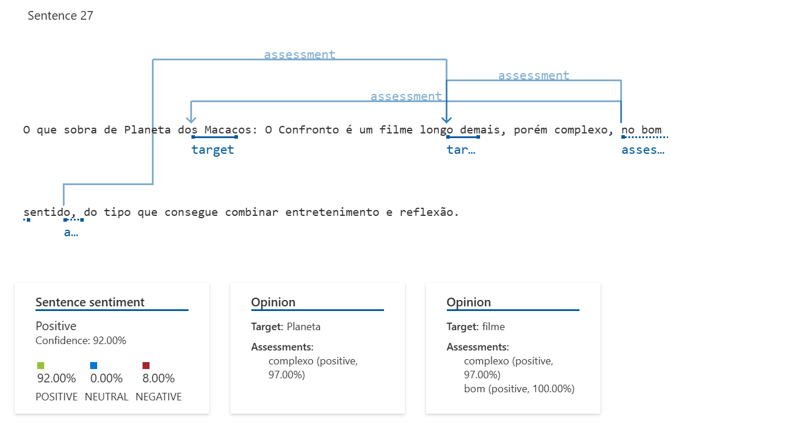

# Criando um arquivo README.md com o conteúdo formatado

readme_content = """# Análise de Sentimentos com Language Studio no Azure AI  

## 📖 Introdução  
Este projeto é uma aplicação prática do módulo *Service Cloud com IA* da trilha **Decola Tech 2025** da **DIO**. O objetivo foi utilizar o **Language Studio do Azure AI** para realizar uma **análise de sentimentos**.  

A análise foi feita de um texto crítico sobre o filme *Planeta dos Macacos: O Confronto* e se a **percepção textual** era coerente com a **nota dada pelo autor** na crítica do site Adoro Cinema. O estudo explorou as limitações da IA na interpretação da linguagem humana, principalmente em contextos implícitos ou irônicos.  

🔗 **Crítica utilizada para análise**: [Adoro Cinema - Planeta dos Macacos: O Confronto](https://www.adorocinema.com/filmes/filme-206986/criticas-adorocinema/)  

---

## 📊 Metodologia  

A análise utilizou o texto crítico retirado do Adoro Cinema para avaliar a interpretação da IA com base nos seguintes pontos:  

1. **Comparação entre análise textual e nota atribuída pelo autor**  
   - O crítico deu **4 estrelas (80%)**, indicando uma avaliação positiva do filme.  
2. **Classificação textual baseada em sentimentos**  
   - A IA categorizou as sentenças em **positivo, neutro ou negativo**.  
3. **Interpretação das limitações da IA**  
   - Foi observado como a IA trata **contexto, ironia e linguagem implícita**.  

---

## 📈 Resultados da Análise  

A IA apresentou a seguinte classificação do texto:  

- **28% Positivo**  
- **8% Neutro**  
- **65% Negativo**  

🔹 Isso sugere uma avaliação **mais negativa** do que a nota dada pelo crítico. **Se a nota dependesse apenas da IA, o filme receberia algo em torno de 2 estrelas.**  

---

## 📌 Conclusões  

A análise revelou dois pontos importantes:  

1. **Textos neutros podem ser interpretados como negativos**  
   - Algumas introduções ou resumos foram erroneamente categorizados como negativos. Os dois primeiros parágrafos, representados nas setenças 2 e 3, são analisados como 86% negativo, porém se trata de uma introdução ou resumo das percepções gerais do filme, o que naturalmente consideramos como neutro;
  

2. **A linguagem humana é complexa e pode enganar a IA**  
   - A IA não compreendeu corretamente uma **pergunta retórica positiva**, classificando-a como neutra. Ao realizar a análise do detalhada do arquivo disponibilizado pelo Language Studio, é possível ainda algumas conclusões como por exemplo as setenças 25 e 26 que fazem parte de um mesmo trecho "Já Andy Serkis... quando mesmo vão indica-lo ao Oscar?" O uso de reticências fez com que a IA transformasse em dois trechos. Partindo para a interpretação, é necessário uma leitura contextualizada em que o autor lança de uma retórica, mas querendo reforçar o apreço pelo ator Andy Serkis questionando se já não era hora de ele ser indicado ao Oscar, reforçando que a atuação dele foi positiva. Este trecho foi entendido pela IA como neutro em torno de 96% (considerando a média); 

📢 *A análise de sentimento pela IA é uma ferramenta poderosa, porém a linguagem humana é bem complexa e um trecho nem sempre pode ser lido de forma isolada, exigindo uma leitura de contexto. Uma ironia será interpretada pela IA como um sentimento contrário ao que queremos expressar visto que geralmente expressamos o contrário da nossa reação.*  

---

## 📂 Arquivos Disponíveis  
Para uma visão completa desta análise, incluí o arquivo em PDF com a impressão da tela e o arquivo JSON gerado desta análise.

- 📄 **Arquivo PDF** → Captura de tela da análise feita no Azure Language Studio  
[text](Análise_Review.pdf)

- 📜 **Arquivo JSON** → Saída da análise detalhada das sentenças  
[text](reviewOne.json)
